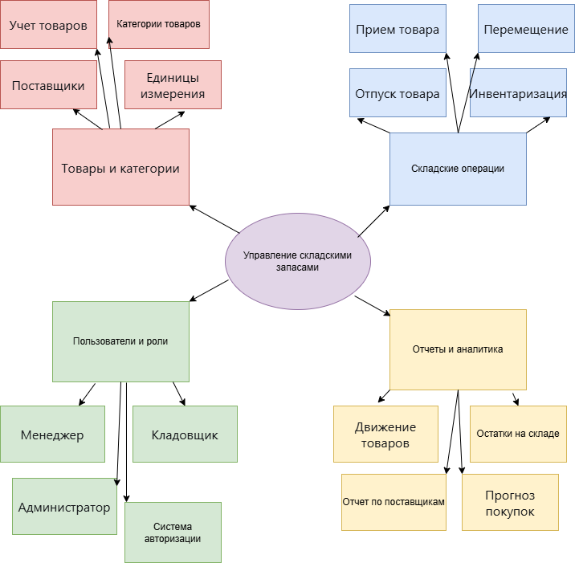

# 2.2. Ментальная карта проекта "Управление складскими запасами"

## Изображение ментальной карты:

---

## Детальное описание структуры ментальной карты:

###  **Центральный элемент (ядро системы)**
**"Управление складскими запасами"**  
Это основная цель системы — автоматизация всех процессов, связанных с учётом товаров на складе предприятия.

---

###  **Ветвь 1: Товары и категории (инфраструктура)**

####  **Учёт товаров**
- **Назначение**: Ведение базы всех товаров на складе
- **Что включает**:
  - Артикулы и уникальные коды товаров
  - Наименования и описания
  - Технические характеристики
  - Фотографии товаров (при необходимости)
- **Важность**: Без правильного учёта товаров невозможна работа всей системы

####  **Категории товаров**
- **Назначение**: Логическая группировка товаров
- **Примеры категорий**:
  - Электроника
  - Хозтовары
  - Стройматериалы
  - Продукты питания
- **Преимущества**: Упрощает поиск и отчётность

####  **Поставщики**
- **Назначение**: Управление контрагентами
- **Информация о поставщиках**:
  - Название компании
  - Контактные лица и телефоны
  - Email для заказов
  - История поставок
  - Рейтинг надёжности
- **Важность**: Для планирования закупок и оценки качества поставок

####  **Единицы измерения**
- **Назначение**: Стандартизация учёта
- **Типы единиц**:
  - Штуки (шт.)
  - Килограммы (кг)
  - Литры (л)
  - Метры (м)
  - Упаковки (уп.)
- **Конвертация**: Возможность пересчёта между единицами

---

###  **Ветвь 2: Складские операции (бизнес-процессы)**

####  **Приём товара**
- **Процесс**: Оформление поступления товаров на склад
- **Документы**: Накладные, счета-фактуры
- **Проверки**: Сверка с документами, проверка качества
- **Результат**: Увеличение остатков на складе

####  **Отпуск товара**
- **Процесс**: Выдача товаров со склада
- **Основания**: Заказы клиентов, внутренние потребности
- **Контроль**: Проверка наличия, резервирование
- **Результат**: Уменьшение остатков на складе

####  **Перемещение**
- **Назначение**: Внутренние перемещения между:
  - Стелажами
  - Зонами хранения
  - Складами предприятия
- **Причины**: Реорганизация склада, пополнение зоны отгрузки

####  **Инвентаризация**
- **Назначение**: Сверка фактических остатков с учётными
- **Периодичность**: Плановая (раз в месяц/квартал) и внеплановая
- **Процесс**: Пересчёт товаров, выявление расхождений
- **Корректировка**: Внесение изменений в учётные данные

---

###  **Ветвь 3: Пользователи и роли (безопасность)**

#### **Администратор**
- **Полномочия**: Полный доступ ко всем функциям
- **Обязанности**:
  - Настройка системы
  - Управление пользователями
  - Резервное копирование
  - Просмотр всех отчётов

####  **Кладовщик**
- **Полномочия**: Работа со складскими операциями
- **Обязанности**:
  - Приём и отпуск товаров
  - Проведение инвентаризации
  - Ведение учёта в своей зоне ответственности

####  **Менеджер**
- **Полномочия**: Аналитические функции
- **Обязанности**:
  - Формирование заказов поставщикам
  - Анализ отчётов
  - Контроль остатков
  - Принятие решений о закупках

####  **Система авторизации**
- **Назначение**: Обеспечение безопасности
- **Компоненты**:
  - Регистрация и вход
  - Разделение прав доступа
  - Журнал действий пользователей
  - Восстановление паролей

---

###  **Ветвь 4: Отчёты и аналитика (принятие решений)**

####  **Остатки на складе**
- **Назначение**: Контроль текущего состояния
- **Что показывает**:
  - Количество каждого товара
  - Стоимость остатков
  - Товары ниже минимального уровня
  - Залежавшиеся товары
- **Формат**: Таблицы, графики, диаграммы

####  **Движение товаров**
- **Назначение**: Анализ активности
- **Периоды**: День, неделя, месяц, квартал, год
- **Показатели**:
  - Количество приходных операций
  - Количество расходных операций
  - Самые популярные товары
  - Сезонные колебания спроса

####  **Отчёт по поставщикам**
- **Назначение**: Оценка работы контрагентов
- **Критерии оценки**:
  - Своевременность поставок
  - Качество товаров
  - Ценовая политика
  - Объёмы поставок
- **Использование**: Для выбора оптимальных поставщиков

####  **Прогноз закупок**
- **Назначение**: Планирование на будущее
- **Методы прогнозирования**:
  - На основе истории продаж
  - С учётом сезонности
  - С учётом плановых акций
  - На основе данных о минимальных остатках
- **Результат**: Рекомендации по закупкам

---

##  **Цели создания ментальной карты:**

1. **Визуализация структуры**: Наглядно представить все компоненты системы
2. **Понимание взаимосвязей**: Показать, как модули связаны между собой
3. **Планирование разработки**: Определить последовательность реализации модулей
4. **Коммуникация с заказчиком**: Объяснить сложную систему простым языком
5. **Выявление пробелов**: Найти недостающие компоненты на раннем этапе

---

##  **Связь с другими разделами документации:**

- **IDEF0**: Ментальная карта даёт общее представление, IDEF0 детализирует процессы
- **DFD**: На основе структуры ментальной карты строятся диаграммы потоков данных
- **UML**: Классы и компоненты UML соответствуют элементам ментальной карты
- **ER-диаграмма**: Сущности БД выводятся из элементов ментальной карты

